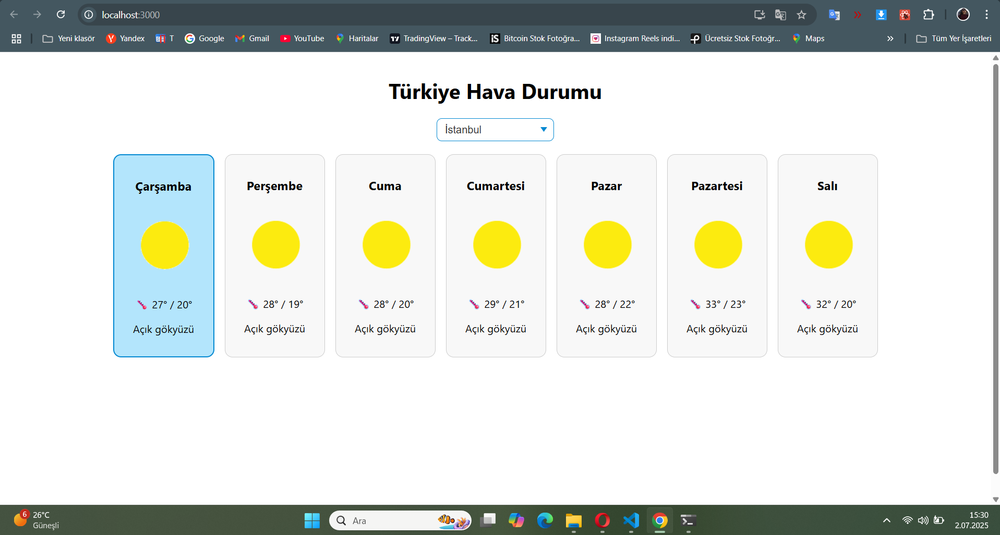

# Weather App Repo

Bu repo bir adet weather app react projesi içermektedir.
READMe dosyası, bir adet index.html barındırıyor.

## Installation
Öncelikle projesi clone alın.

```
git clone https://github.com/MehtapAyall/weather-app.git
```

## Usage
Projeyi clone aldıktan sonra VS Code pogramınd açın. Bunun için clone aldıktan sonra: 

```
cd weather-app
code .
```

## Proje Görseli

